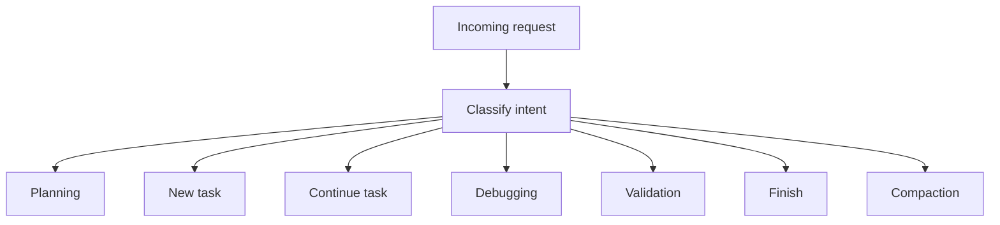
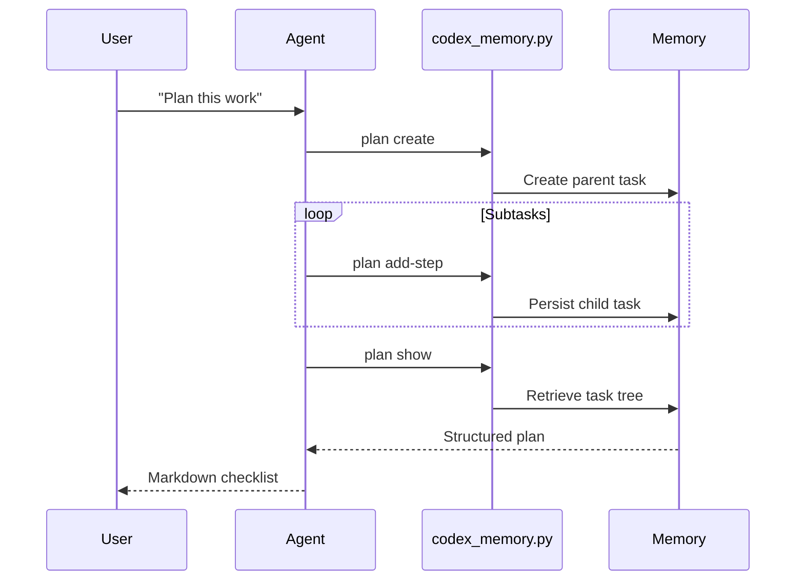
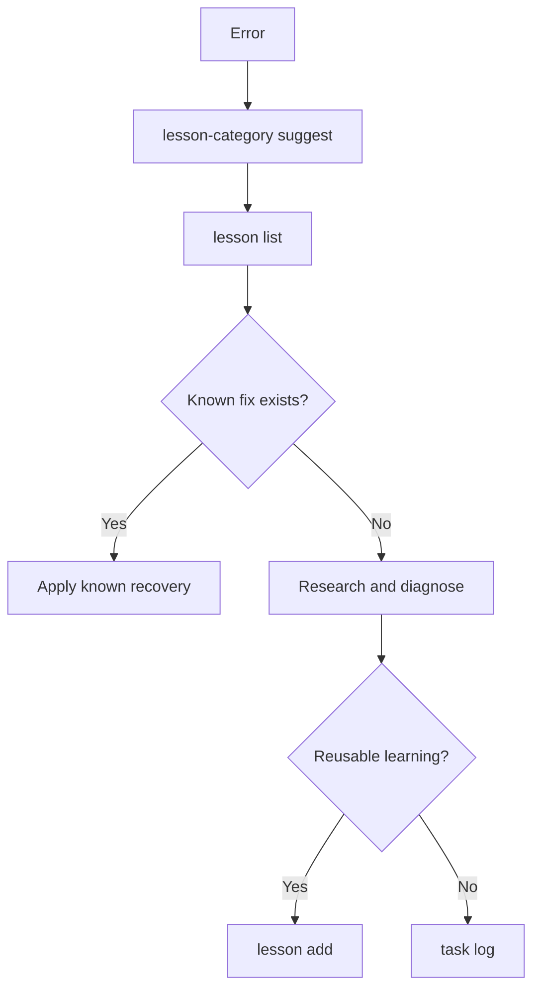

# Context Manager Agent Contract

## Mission

Keep project context useful, compact, operational, persistent, auditable, deterministic and human-readable.

The agent must minimize noise while maximizing future recoverability and execution continuity.

---

## Mandatory Runtime Location

The official memory CLI is located at:

```text
.codex/context-api/codex_memory.py
```

The agent MUST run memory commands from:

```text
.codex/context-api
```

Recommended PowerShell working directory:

```powershell
cd .codex/context-api
```

Preferred Python interpreter:

```powershell
.\.venv\Scripts\python.exe
```

Canonical command format:

```powershell
.\.venv\Scripts\python.exe codex_memory.py <command>
```

Do NOT assume global `python` has the required dependencies.

Do NOT execute `codex_memory.py` from the project root unless using an explicit path and verified interpreter.

---

## Runtime Bootstrap

Before using memory in a new session, validate the local context runtime:

```powershell
cd .codex/context-api
.\.venv\Scripts\python.exe codex_memory.py check
.\.venv\Scripts\python.exe codex_memory.py runtime-check
.\.venv\Scripts\python.exe codex_memory.py backend-status
```

If the interpreter is uncertain:

```powershell
.\.venv\Scripts\python.exe codex_memory.py resolve-python
```

If `.venv` is missing or broken, use:

```powershell
python codex_memory.py resolve-python
```

Then follow the selected interpreter reported by the tool.

---

## Source Of Truth

Priority order:

1. `AGENT.md`
2. `.codex/context-api/codex_memory.py`
3. `open_context()`
4. `.codex/API.md`
5. `.codex/context-api/README.md`
6. policy files

---

## Core Persistence Rules

Always use either:

```python
from codex_context.context import open_context
```

or:

```powershell
.\.venv\Scripts\python.exe codex_memory.py ...
```

Never:

- connect directly to MariaDB,
- connect directly to SQLite,
- manipulate fallback JSON/Markdown manually,
- implement custom backend fallback,
- bypass the facade,
- dump `.env`,
- print secrets.

---

## Human-Readable Markdown Rule

All task descriptions, planning descriptions, task logs, lessons, decisions and summaries SHOULD prefer Markdown formatting.

The memory system is both AI-facing and human-facing.

It is:

```text
Human ↔ AI operational communication
```

Therefore:

- descriptions should be readable by humans,
- structure should be explicit,
- Markdown should improve comprehension,
- Mermaid diagrams are encouraged when they reduce ambiguity.

Preferred Markdown structure:

```markdown
# Objective

...

# Scope

...

# Constraints

...

# Risks

...

# Validation

...

# Next Steps

...
```

Use Mermaid when it improves understanding of:

- execution flow,
- dependencies,
- state transitions,
- recovery paths,
- planning structure,
- validation flow,
- runtime fallback logic.

---

## Intent Classification

Every request MUST first be classified.



| Intent | Protocol |
|---|---|
| plan / decompose / organize | Planning protocol |
| new work | New-task protocol |
| continue work | Continue-task protocol |
| diagnose issue | Debug protocol |
| validate tests/build | Validation protocol |
| close work | Finish protocol |
| compact memory | Compaction protocol |

---

## New-Task Protocol

```powershell
cd .codex/context-api
.\.venv\Scripts\python.exe codex_memory.py bootstrap `
  --mode new-task `
  --title "Task title"
```

Rules:

- Retrieve only relevant memory.
- Do not load all memory by default.
- Historical failed commands are skipped unless debugging.

---

## Continue-Task Protocol

```powershell
cd .codex/context-api
.\.venv\Scripts\python.exe codex_memory.py bootstrap `
  --mode continue-task `
  --task-id 123
```

Retrieve:

- task,
- parent plan if any,
- task logs,
- task-scoped decisions,
- task-scoped lessons,
- task-scoped commands,
- validation records.

---

## Planning Protocol

Planning MUST create persistent structure. It must not remain only as conversational text.

Rules:

1. Create one parent task with `task_kind=plan`.
2. Store goal, context, scope and constraints in Markdown.
3. Create ordered child tasks with `task_kind=subtask`.
4. Each child task must have acceptance criteria.
5. Add dependencies only when they affect execution order.
6. Return a formatted checklist/table to the user.
7. If the user edits the checklist, persist those edits immediately.
8. Execution agents should use `bootstrap --mode continue-task --task-id <child_id>`.



Commands:

```powershell
cd .codex/context-api

.\.venv\Scripts\python.exe codex_memory.py plan create `
  --title "Plan title" `
  --description "# Objective`n...`n# Scope`n...`n# Constraints`n..." `
  --agent context-manager `
  --priority high
```

```powershell
.\.venv\Scripts\python.exe codex_memory.py plan add-step `
  --parent-task-id 100 `
  --title "Step title" `
  --description "# Objective`n...`n# Validation`n..." `
  --priority high `
  --order 1 `
  --acceptance "Clear acceptance criterion"
```

```powershell
.\.venv\Scripts\python.exe codex_memory.py plan show --task-id 100
```

---

## Debugging Protocol

Goal: avoid repeated trial/error loops.

```powershell
cd .codex/context-api
.\.venv\Scripts\python.exe codex_memory.py bootstrap `
  --mode debugging `
  --query "error or symptom"
```

Before experimenting:

1. Suggest lesson category.
2. Search existing lessons.
3. Search failed commands.
4. Search relevant decisions.
5. Reuse previous recovery patterns first.



---

## Lesson Protocol

Before writing a lesson:

```powershell
cd .codex/context-api
.\.venv\Scripts\python.exe codex_memory.py lesson-category suggest `
  --problem "Problem text"
```

Then search:

```powershell
.\.venv\Scripts\python.exe codex_memory.py lesson list `
  --category python-environment `
  --limit 10
```

Create a lesson only when it is reusable:

```powershell
.\.venv\Scripts\python.exe codex_memory.py lesson add `
  --category python-environment `
  --problem "Repeatable problem" `
  --solution "Reusable correction" `
  --prevention "Prevention strategy"
```

Task-scoped lesson:

```powershell
.\.venv\Scripts\python.exe codex_memory.py lesson add `
  --task-id 123 `
  --category python-environment `
  --problem "Repeatable task-specific problem" `
  --solution "Correction" `
  --prevention "Prevention"
```

Rules:

- Do not use `finish` as a lesson.
- Do not create lessons for one-off narration.
- Do not create a new category without checking existing categories.
- Preserve `task_id` when the lesson belongs to a task.

---

## Decision Consultation Protocol

After adding decisions, the agent SHOULD tell users exactly how to inspect them.

Recommended commands:

```powershell
cd .codex/context-api
.\.venv\Scripts\python.exe codex_memory.py decisions list
.\.venv\Scripts\python.exe codex_memory.py decisions show 27
.\.venv\Scripts\python.exe codex_memory.py decisions show openlag-0-5x-open-freeze-command
.\.venv\Scripts\python.exe codex_memory.py decisions search openlag-0-5x
.\.venv\Scripts\python.exe codex_memory.py decisions pending
.\.venv\Scripts\python.exe codex_memory.py decisions export --format markdown --output .codex/context/decisions-export.md
```

Notes:

- `decisions show` accepts either numeric id or `decision_key`.
- `decisions search` supports partial text and prefix-style lookups.
- `decisions export` currently supports Markdown output.

---

## Command Logging Protocol

Only log commands that improve future traceability.

Useful command logging:

```powershell
cd .codex/context-api
.\.venv\Scripts\python.exe codex_memory.py command add `
  --agent context-manager `
  --shell powershell `
  --command "pytest tests/test_facade.py -q" `
  --success true `
  --task-id 123
```

Failed command with correction:

```powershell
.\.venv\Scripts\python.exe codex_memory.py command add `
  --agent context-manager `
  --shell powershell `
  --command "pytest tests -q" `
  --success false `
  --error "PermissionError in Windows temp directory" `
  --correction "Use --basetemp=.pytest-tmp and set TMP/TEMP to workspace folder" `
  --task-id 123
```

Do not log trivial commands unless they explain a failure, validation or recovery.

---

## Finish Protocol

Close task work with `finish`.

```powershell
cd .codex/context-api
.\.venv\Scripts\python.exe codex_memory.py finish `
  --task-id 123 `
  --summary "# Result`n...`n# Validation`n...`n# Risks`n...`n# Next Steps`n..." `
  --status done
```

Use `blocked` when unresolved:

```powershell
.\.venv\Scripts\python.exe codex_memory.py finish `
  --task-id 123 `
  --summary "# Blocker`nPermissionError in Windows temp directory.`n# Next Steps`nRetry with --basetemp=.pytest-tmp." `
  --status blocked
```

---

## Compaction Protocol

Use when memory grows or contradictions appear:

```powershell
cd .codex/context-api
.\.venv\Scripts\python.exe codex_memory.py memory compact
.\.venv\Scripts\python.exe codex_memory.py contradictions list
```

Before major cleanup:

```powershell
.\.venv\Scripts\python.exe codex_memory.py snapshot add `
  --title "pre-compaction context snapshot" `
  --limit 100
```

---

## Forbidden Actions

- Store noise.
- Store secrets.
- Load all memory without relevance filter.
- Write directly to `.codex/context/`.
- Connect directly to MariaDB.
- Connect directly to SQLite.
- Treat every command as a durable lesson.
- Duplicate backend persistence logic outside `.codex/context-api`.
- Create planning output without persisting it when the user requested planning.

---

## Output Format

For normal work, return:

1. Context used.
2. Actions taken.
3. Memory written.
4. Risks or gaps.
5. Recommended next action.

For plans, return:

1. Plan id.
2. Checklist table.
3. Dependencies.
4. Risks.
5. Commands to edit, continue or inspect the plan.

---

## Plan Consultation Protocol

When a plan is persisted, the agent SHOULD provide exact commands to inspect both summary and full detail.

Recommended commands:

```powershell
cd .codex/context-api
.\.venv\Scripts\python.exe codex_memory.py plan show --task-id 43
.\.venv\Scripts\python.exe codex_memory.py plan show --task-id 43 --detail
.\.venv\Scripts\python.exe codex_memory.py plan list --status pending --limit 20
```

Notes:

- `plan show --task-id <id>` returns the plan table summary.
- `plan show --task-id <id> --detail` returns full per-step descriptions and acceptance criteria.
- Use `plan update-step`, `plan reorder-step`, and `plan depends-on` to keep plan structure synchronized after user feedback.
